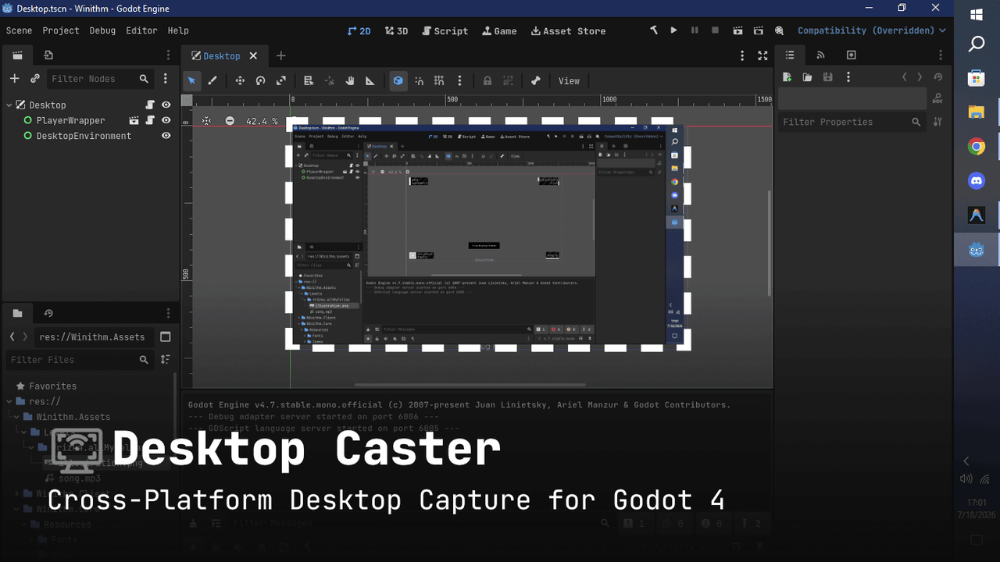
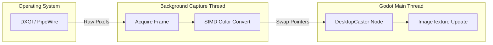

# 🎥 Godot Desktop Caster


**GD Desktop Caster** is a high-performance, cross-platform Godot 4.x GDExtension for real-time desktop screen capture. Written entirely in **Rust**, it utilizes native OS-level APIs to achieve minimal latency and zero overhead on Godot's main rendering thread.



---

## 📖 Table of Contents
- [🎥 Godot Desktop Caster](#-godot-desktop-caster)
  - [📖 Table of Contents](#-table-of-contents)
  - [⚡ Why GD Desktop Caster?](#-why-gd-desktop-caster)
  - [🌍 Platform Support](#-platform-support)
  - [🧠 Architecture \& Performance](#-architecture--performance)
  - [🛠 Usage in Godot](#-usage-in-godot)
    - [1. The `DesktopCaster` Node](#1-the-desktopcaster-node)
    - [2. Usage Examples (GDScript \& C#)](#2-usage-examples-gdscript--c)
      - [GDScript](#gdscript)
      - [C#](#c)
  - [📚 API Reference](#-api-reference)
    - [Properties](#properties)
    - [Methods](#methods)
    - [Enumerations \& Constants](#enumerations--constants)
  - [🏗 Building from Source](#-building-from-source)
    - [Prerequisites](#prerequisites)
    - [Windows](#windows)
    - [Linux (Ubuntu/Debian)](#linux-ubuntudebian)
    - [Deployment](#deployment)
  - [📄 License](#-license)

---

## ⚡ Why GD Desktop Caster?

Godot lacks native, high-performance desktop capture capabilities out of the box. Existing solutions often rely on slow read-backs or block the main thread. **gd-desktop-caster** solves this by:

1. **True Multithreading**: Frame capture runs entirely on a background thread. Your game's FPS will never drop when a frame is being captured.
2. **Zero-Copy Architecture (Where possible)**: Optimized memory swapping (Double Buffering) guarantees `O(1)` lock time on the main thread.
3. **SIMD Optimization**: Color space conversions (like BGRA to RGBA) are vectorized for extreme speeds.

---

## 🌍 Platform Support

| OS | Backend API | Status | Notes |
| :--- | :--- | :--- | :--- |
| **Windows** | DXGI Desktop Duplication | 🟢 Production Ready | Extremely fast. Utilizes GPU-accelerated staging textures. |
| **Linux (Wayland)** | PipeWire & XDG Portal | 🟢 Production Ready | The modern Linux standard. Requires user consent dialog. |
| **Linux (X11)** | X11 `XGetImage` (MIT-SHM) | 🟡 Fallback Ready | Ultra-compatible, kicks in automatically if PipeWire fails. |
| **macOS** | ScreenCaptureKit | 🔴 Planned | Coming soon! |

---

## 🧠 Architecture & Performance

To prevent the Godot Engine from freezing during heavy screen captures, we implemented a **Double-Buffered Lock-Free-ish Handoff** system:



1. **OS API** delivers the frame to our **Worker Thread**.
2. The Worker converts the color space (e.g., `BGRx` -> `RGBA`) into a hidden `local_buffer`.
3. When Godot updates, the texture is updated in-place without blocking the main render loop.

---

## 🛠 Usage in Godot

Using the plugin in your Godot project is as simple as adding a Node.

### 1. The `DesktopCaster` Node
Once the plugin is installed, a new custom node called `DesktopCaster` will be available in Godot. Add it to your scene.

### 2. Usage Examples (GDScript & C#)

Assign the live texture once during initialization — the texture updates in-place, so there is no need to reassign it in `_process()`.

#### GDScript
```gdscript
extends Control

@onready var caster: DesktopCaster = $DesktopCaster
@onready var rect: TextureRect = $TextureRect

func _ready():
    # Start capturing
    if caster.start():
        # Assign the live texture once
        rect.texture = caster.get_texture()
    else:
        print("Failed to start capture: ", caster.get_last_error())
```

#### C#
Since custom GDExtension classes are dynamically bound, call methods on the node using `Call(...)`:

```csharp
using Godot;

public partial class CaptureView : Control
{
    private Node _caster;
    private TextureRect _textureRect;

    public override void _Ready()
    {
        _caster = GetNode<Node>("DesktopCaster");
        _textureRect = GetNode<TextureRect>("TextureRect");

        // Call start() via Call()
        bool success = (bool)_caster.Call("start");
        if (success)
        {
            // Get texture and assign it to TextureRect
            var texture = _caster.Call("get_texture").As<ImageTexture>();
            _textureRect.Texture = texture;
        }
        else
        {
            string error = (string)_caster.Call("get_last_error");
            GD.PrintErr($"Failed to start capture: {error}");
        }
    }
}
```

---

## 📚 API Reference

### Properties

| Name | Type | Default | Description |
| :--- | :--- | :--- | :--- |
| `fps_mode` | `int` ([`FpsMode`](#enumerations--constants)) | `0` (`MANUAL`) | Controls how the capture rate is determined (`MANUAL` or `VSYNC`). |
| `target_fps` | `int` | `30` | Target frame rate when `fps_mode` is set to `MANUAL` (clamped between 1..240). |

### Methods

| Return Type | Method & Description |
| :--- | :--- |
| `bool` | **`start()`**<br>Starts desktop capture on a background thread. Automatically detects primary display size. Returns `true` on success. |
| `void` | **`stop()`**<br>Stops desktop capture and joins the background thread. Called automatically when exiting scene tree. |
| `ImageTexture` | **`get_texture()`**<br>Returns the live `ImageTexture` updated each frame. Returns `null` if capture has not started. |
| `bool` | **`is_capturing()`**<br>Returns `true` if the capture thread is currently running. |
| `String` | **`get_last_error()`**<br>Returns the last error message reported by the capture thread, or empty string if no error. |
| `void` | **`set_fps_mode_runtime(mode: int)`**<br>Changes the FPS mode while capture is running without restarting the thread. |
| `void` | **`set_target_fps_runtime(target_fps: int)`**<br>Changes target frame rate while capture is running (for `MANUAL` mode). |

### Enumerations & Constants

**`enum FpsMode`**:
| Constant | Value | Description |
| :--- | :--- | :--- |
| **`MANUAL`** | `0` | Capture at a user-selected rate specified by `target_fps`. |
| **`VSYNC`** | `1` | Capture whenever the OS compositor presents a new frame for maximum smoothness. |

---

## 🏗 Building from Source

### Prerequisites
- [Godot 4.x](https://godotengine.org/)
- [Rust Toolchain](https://rustup.rs/) (Cargo)

### Windows
```powershell
git clone https://github.com/Nekitori17/gd-desktop-caster.git
cd gd-desktop-caster/rust
cargo build --release
```
The resulting `gd_desktop_caster.dll` will be in `rust/target/release/`.

### Linux (Ubuntu/Debian)
You will need PipeWire and X11 development headers:
```bash
sudo apt-get install libpipewire-0.3-dev libx11-dev
git clone https://github.com/Nekitori17/gd-desktop-caster.git
cd gd-desktop-caster/rust
cargo build --release
```
The resulting `libgd_desktop_caster.so` will be in `rust/target/release/`.

### Deployment
Copy the compiled dynamic library (`.dll` or `.so`) into your Godot project's `addons/desktop_capture/bin/` folder and ensure your `.gdextension` file points to it.

---

## 📄 License

This project is licensed under the [MIT License](LICENSE) - see the LICENSE file for details. Copyright (c) 2026 Nekitori17.
