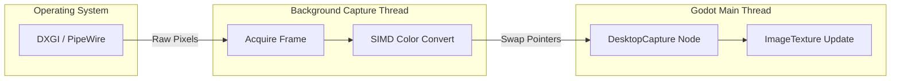

# 🎥 Godot Desktop Caster


**GD Desktop Caster** is a high-performance, cross-platform Godot 4.x GDExtension for real-time desktop screen capture. Written entirely in **Rust**, it utilizes native OS-level APIs to achieve minimal latency and zero overhead on Godot's main rendering thread.

---

## 📖 Table of Contents
- [🎥 Godot Desktop Caster](#-godot-desktop-caster)
  - [📖 Table of Contents](#-table-of-contents)
  - [⚡ Why GD Desktop Caster?](#-why-gd-desktop-caster)
  - [🌍 Platform Support](#-platform-support)
  - [🧠 Architecture \& Performance](#-architecture--performance)
  - [🛠 Usage in Godot](#-usage-in-godot)
    - [1. The `DesktopCapture` Node](#1-the-desktopcapture-node)
    - [2. Usage Examples (GDScript \& C#)](#2-usage-examples-gdscript--c)
      - [GDScript](#gdscript)
      - [C#](#c)
  - [🏗 Building from Source](#-building-from-source)
    - [Prerequisites](#prerequisites)
    - [Windows](#windows)
    - [Linux (Ubuntu/Debian)](#linux-ubuntudebian)
    - [Deployment](#deployment)
  - [📄 License](#-license)

---

## ⚡ Why GD Desktop Caster?

Godot lacks native, high-performance desktop capture capabilities out of the box. Existing solutions often rely on slow read-backs or block the main thread. **gd-desktop-caster** solves this by:

1. **True Multithreading**: Frame capture runs entirely on a background thread. Your game's FPS will never drop when a frame is being captured.
2. **Zero-Copy Architecture (Where possible)**: Optimized memory swapping (Double Buffering) guarantees `O(1)` lock time on the main thread.
3. **SIMD Optimization**: Color space conversions (like BGRA to RGBA) are vectorized for extreme speeds.

---

## 🌍 Platform Support

| OS | Backend API | Status | Notes |
| :--- | :--- | :--- | :--- |
| **Windows** | DXGI Desktop Duplication | 🟢 Production Ready | Extremely fast. Utilizes GPU-accelerated staging textures. |
| **Linux (Wayland)** | PipeWire & XDG Portal | 🟢 Production Ready | The modern Linux standard. Requires user consent dialog. |
| **Linux (X11)** | X11 `XGetImage` (MIT-SHM) | 🟡 Fallback Ready | Ultra-compatible, kicks in automatically if PipeWire fails. |
| **macOS** | ScreenCaptureKit | 🔴 Planned | Coming soon! |

---

## 🧠 Architecture & Performance

To prevent the Godot Engine from freezing during heavy screen captures, we implemented a **Double-Buffered Lock-Free-ish Handoff** system:



1. **OS API** delivers the frame to our **Worker Thread**.
2. The Worker converts the color space (e.g., `BGRx` -> `RGBA`) into a hidden `local_buffer`.
3. When Godot calls `_process()` and requests a frame, we simply **swap** the pointers of the `local_buffer` and `front_buffer` in a microsecond.

---

## 🛠 Usage in Godot

Using the plugin in your Godot project is as simple as adding a Node.

### 1. The `DesktopCapture` Node
Once the plugin is installed, a new custom node called `DesktopCapture` will be available in Godot. Add it to your scene.

### 2. Usage Examples (GDScript & C#)

You can easily route the captured screen to any `TextureRect` or 3D Material:

#### GDScript
```gdscript
extends Control

@onready var desktop_capture: DesktopCapture = $DesktopCapture
@onready var texture_rect: TextureRect = $TextureRect

func _ready():
    # Optional: Configure capture settings
    pass

func _process(_delta: float):
    # Check if a new frame has been delivered by the background thread
    if desktop_capture.is_frame_ready():
        # Apply the high-performance ImageTexture directly to our UI
        texture_rect.texture = desktop_capture.get_texture()
```

#### C#
```csharp
using Godot;

public partial class CaptureView : Control
{
    private DesktopCapture _desktopCapture;
    private TextureRect _textureRect;

    public override void _Ready()
    {
        _desktopCapture = GetNode<DesktopCapture>("DesktopCapture");
        _textureRect = GetNode<TextureRect>("TextureRect");
    }

    public override void _Process(double delta)
    {
        // Check if a new frame has been delivered by the background thread
        if (_desktopCapture.IsFrameReady())
        {
            // Apply the high-performance ImageTexture directly to our UI
            _textureRect.Texture = _desktopCapture.GetTexture();
        }
    }
}
```

---

## 🏗 Building from Source

### Prerequisites
- [Godot 4.x](https://godotengine.org/)
- [Rust Toolchain](https://rustup.rs/) (Cargo)

### Windows
```powershell
git clone https://github.com/Nekitori17/gd-desktop-caster.git
cd gd-desktop-caster/rust
cargo build --release
```
The resulting `gd_desktop_caster.dll` will be in `rust/target/release/`.

### Linux (Ubuntu/Debian)
You will need PipeWire and X11 development headers:
```bash
sudo apt-get install libpipewire-0.3-dev libx11-dev
git clone https://github.com/Nekitori17/gd-desktop-caster.git
cd gd-desktop-caster/rust
cargo build --release
```
The resulting `libgd_desktop_caster.so` will be in `rust/target/release/`.

### Deployment
Copy the compiled dynamic library (`.dll` or `.so`) into your Godot project's `addons/desktop_capture/bin/` folder and ensure your `.gdextension` file points to it.

---

## 📄 License

This project is licensed under the [MIT License](LICENSE) - see the LICENSE file for details. Copyright (c) 2026 Nekitori17.
