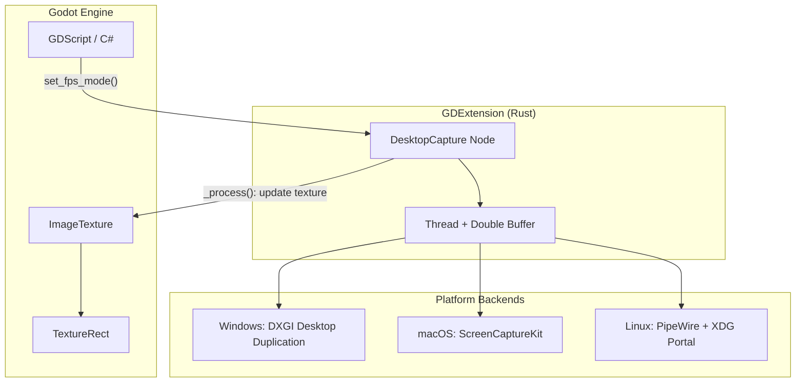
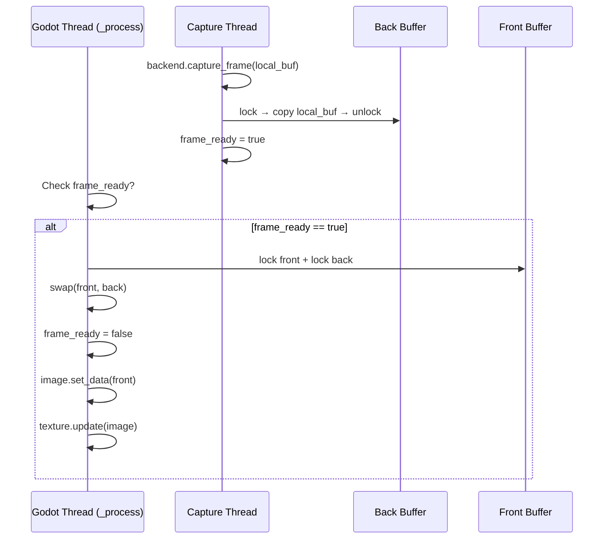

# Guide: Godot 4 Desktop Capture GDExtension bằng Rust

Hướng dẫn xây dựng một **Godot Addon** (GDExtension) viết bằng Rust, hỗ trợ cả **C#** và **GDScript**, cross-platform (Windows / macOS / Linux).

> [!IMPORTANT]
> **Trạng thái source hiện tại:** backend DXGI trên Windows đã có implementation. macOS và Linux hiện trả lỗi có kiểm soát, chưa phải backend hoàn chỉnh; không đóng gói chúng như tính năng hoạt động. `rust/src/` là source of truth, vì các đoạn code minh hoạ phía dưới có thể cũ hơn implementation.

---

## Mục lục

1. [Kiến trúc tổng quan](#1-kiến-trúc-tổng-quan)
2. [Chuẩn bị môi trường](#2-chuẩn-bị-môi-trường)
3. [Thiết lập project Rust (gdext)](#3-thiết-lập-project-rust-gdext)
4. [Thiết kế API: Node `DesktopCapture`](#4-thiết-kế-api-node-desktopcapture)
5. [Backend chụp màn hình per-platform](#5-backend-chụp-màn-hình-per-platform)
6. [Threading & Double Buffer](#6-threading--double-buffer)
7. [Đẩy frame lên Godot Texture](#7-đẩy-frame-lên-godot-texture)
8. [Chế độ FPS Lock vs Unlimited](#8-chế-độ-fps-lock-vs-unlimited)
9. [Build & đóng gói Addon](#9-build--đóng-gói-addon)
10. [Tích hợp vào Winithm.Client](#10-tích-hợp-vào-winithmclient)
11. [Checklist & Lưu ý](#11-checklist--lưu-ý)

---

## 1. Kiến trúc tổng quan



**Ý tưởng cốt lõi:**
- Rust GDExtension expose ra một `Node` tên `DesktopCapture` kế thừa `Node`.
- Node này chạy một **background thread** để liên tục chụp màn hình desktop.
- Mỗi frame Godot (`_process`), node kiểm tra xem có frame mới không. Nếu có, nó swap buffer và gọi `ImageTexture::update()` để đẩy pixel lên GPU.
- Vì `DesktopCapture` là một GDExtension node thực thụ, nó tự động hoạt động với cả GDScript lẫn C# mà không cần wrapper gì thêm.

---

## 2. Chuẩn bị môi trường

### Rust Toolchain
```bash
# Cài Rust (nếu chưa có)
curl --proto '=https' --tlsv1.2 -sSf https://sh.rustup.rs | sh

# Thêm target cho cross-compile (tùy chọn)
rustup target add x86_64-pc-windows-msvc
rustup target add x86_64-apple-darwin
rustup target add aarch64-apple-darwin
rustup target add x86_64-unknown-linux-gnu
```

### Godot 4
- Bản stable mới nhất hiện tại (tháng 7/2026) là **Godot 4.7** ("Lights, Camera, Action!", phát hành 18/6/2026). Nên nhắm tới bản này hoặc ít nhất **4.5+** để có đầy đủ API mới nhất của gdext; `compatibility_minimum` trong `.gdextension` vẫn có thể để thấp hơn (vd. 4.3) nếu cần hỗ trợ ngược.
- Nếu dùng C#: cần bản **Godot .NET** (mono).

> [!NOTE]
> **MSRV (Minimum Supported Rust Version):** Cargo.toml bên dưới dùng `edition = "2024"`, đã stable từ Rust 1.85.0 (20/2/2025). Chạy `rustup update stable` trước khi build để chắc chắn không bị lỗi edition không tồn tại.

---

## 3. Thiết lập project Rust (gdext)

### 3.1 Cấu trúc thư mục

```
addons/
└── desktop_capture/
    ├── rust/                          ← Rust source code
    │   ├── Cargo.toml
    │   ├── .gdignore                  ← BẮT BUỘC: Godot bỏ qua thư mục này
    │   └── src/
    │       ├── lib.rs                 ← Entry point, đăng ký GDExtension
    │       ├── desktop_capture.rs     ← Node chính
    │       ├── capture_thread.rs      ← Logic thread + double buffer
    │       └── backends/
    │           ├── mod.rs             ← Platform dispatch
    │           ├── windows.rs         ← DXGI Desktop Duplication
    │           ├── macos.rs           ← ScreenCaptureKit
    │           └── linux.rs           ← PipeWire + XDG Portal
    ├── bin/                           ← Compiled .dll / .so / .dylib
    │   ├── desktop_capture.windows.x86_64.dll
    │   ├── libdesktop_capture.macos.universal.dylib
    │   └── libdesktop_capture.linux.x86_64.so
    ├── desktop_capture.gdextension    ← Godot extension manifest
    └── plugin.cfg                     ← Godot addon manifest (tùy chọn)
```

### 3.2 Cargo.toml

> [!IMPORTANT]
> **Đã kiểm tra trực tiếp trên crates.io/docs.rs (7/2026)** — các version dưới đây là bản mới nhất tại thời điểm viết, thay cho các version cũ (đã lỗi thời) trong bản nháp đầu. Khác biệt lớn nhất: `godot` giờ nên ghim version release (`0.5.x`) thay vì trỏ `branch = "master"`, và `screencapturekit` đã lên **major version 1.5** với API viết lại hoàn toàn (xem cảnh báo ở mục 5.3).

```toml
[package]
name = "desktop_capture"
version = "0.1.0"
edition = "2024"

[lib]
crate-type = ["cdylib"]

[dependencies]
# Ghim version cụ thể từ crates.io (godot 0.5.4, phát hành 23/6/2026) thay vì
# git branch = "master": bản git là bleeding-edge, có thể breaking bất cứ lúc nào
# và không có gì đảm bảo SemVer. crates.io release mới cách master một khoảng
# nhỏ nhưng ổn định hơn nhiều cho một addon sẽ build lại nhiều lần.
godot = { version = "0.5", features = ["experimental-threads"] }

# === Platform-specific dependencies ===

[target.'cfg(target_os = "windows")'.dependencies]
# 0.58 → 0.62: nhiều bản vá + API cleanup từ Microsoft. Dùng range để tránh
# duplicate version trong dependency graph khi các crate khác cũng phụ thuộc windows-rs.
windows = { version = ">=0.60, <=0.62", features = [
    "Win32_Graphics_Dxgi",
    "Win32_Graphics_Dxgi_Common",
    "Win32_Graphics_Direct3D11",
    "Win32_Graphics_Direct3D",
] }

[target.'cfg(target_os = "macos")'.dependencies]
# 0.7 → 1.5: rewrite lớn, giờ hỗ trợ frame delivery zero-copy qua IOSurface/Metal
# và model callback (push) thay vì poll — xem lưu ý kiến trúc ở mục 5.3.
screencapturekit = "1.5"

[target.'cfg(target_os = "linux")'.dependencies]
ashpd = { version = "0.13", features = ["pipewire"] }   # XDG Desktop Portal (0.10 → 0.13)
pipewire = "0.9"                                        # pipewire-rs (0.8 → 0.9)

# ─────────────────────────────────────────────────────────────────
# Cấu hình profile cho hiệu năng tối đa ở bản release
# ─────────────────────────────────────────────────────────────────
[profile.release]
opt-level = 3          # tối ưu tốc độ tối đa (mặc định của release, ghi rõ cho chắc)
lto = "fat"             # Link-Time Optimization toàn crate graph — giảm overhead gọi hàm
                         # xuyên module, quan trọng vì capture_thread.rs gọi backend rất nhiều lần/giây
codegen-units = 1       # đánh đổi thời gian compile để LLVM tối ưu tối đa (không ảnh hưởng build debug)
panic = "unwind"        # XEM CẢNH BÁO BÊN DƯỚI — không đổi thành "abort"
strip = "debuginfo"     # giảm size DLL/SO cuối, không ảnh hưởng tốc độ runtime

[profile.dev]
opt-level = 1            # giữ debug build chạy được ở tốc độ chấp nhận được khi test capture loop
```

> [!CAUTION]
> **KHÔNG đặt `panic = "abort"` trong `[profile.release]`**, dù đây là mẹo phổ biến để giảm size binary Rust. Lý do: `.dll`/`.so` của bạn được **load vào tiến trình Godot đang chạy**, không phải chạy độc lập. gdext tự động bọc `catch_unwind` quanh các callback (`_process`, `init`, hàm `#[func]`, …) để nếu code Rust panic, gdext bắt lại và in ra lỗi trong Godot console — engine vẫn sống. Nếu bạn build với `panic = "abort"`, một panic bất kỳ (kể cả trong capture thread) sẽ gọi thẳng `abort()` và **crash toàn bộ Godot editor/game**, không chỉ riêng addon. Đây là điều chính các maintainer của gdext cũng khuyến cáo không nên làm.

### 3.2bis Safeguard Levels — công cụ chính thức cho "hiệu năng tối đa" (mới trong gdext v0.5)

Đây là bản cập nhật quan trọng nhất liên quan trực tiếp đến yêu cầu tối ưu hiệu năng: kể từ **godot-rust v0.5** (ra mắt 3/2026), crate `godot` có 3 tầng "safeguard" đánh đổi giữa an toàn runtime và tốc độ:

| Tầng | Khi nào dùng | Đặc điểm |
|------|-------------|----------|
| 🛡️ **Strict** | Mặc định ở `dev` build | Check nhiều nhất (RTTI, borrow trên `Gd::bind()`, invariant hình học...) để bắt bug sớm |
| ⚖️ **Balanced** | Mặc định ở `release` build | Vẫn an toàn (không UB trong safe Rust), nhưng ít check hơn Strict |
| ☣️ **Disengaged** | Opt-in, cho 1% extension cần tối đa tốc độ | Bỏ gần hết check runtime (object liveness, borrow check trên `Gd::bind_mut()`...) → UB nếu code sai |

Với một GDExtension chạy background thread liên tục 30-144 lần/giây như `DesktopCapture`, tầng **Balanced** (mặc định) thường đã đủ nhanh — theo chính tài liệu gdext, phần lớn extension không cần đến Disengaged. Nhưng nếu sau khi profile bạn thấy overhead từ các check `Gd<T>` đáng kể, có thể bật Disengaged **chỉ cho release build**:

```toml
[dependencies]
godot = { version = "0.5", features = ["experimental-threads", "safeguards-release-disengaged"] }
```

> [!WARNING]
> Bật `safeguards-release-disengaged` khiến việc truy cập object đã bị free hoặc alias `Gd::bind_mut()` sai trở thành **UB tức thì** thay vì panic có kiểm soát. Luôn test kỹ ở tầng Balanced trước, và nếu báo lỗi ở Disengaged, hãy tái hiện lại ở Balanced trước khi report bug. Vì node `DesktopCapture` trong guide này hầu như không giữ `Gd<T>` nào bị truy cập đa luồng (thread nền chỉ ghi vào `Arc<Mutex<Vec<u8>>>` thuần Rust, không đụng vào Godot object), rủi ro khi bật Disengaged ở đây tương đối thấp — nhưng vẫn nên đo (benchmark) trước khi quyết định, thay vì bật mặc định.

---

### 3.3 lib.rs — Entry Point

```rust
use godot::prelude::*;

mod desktop_capture;
mod capture_thread;
mod backends;

struct DesktopCaptureExtension;

#[gdextension]
unsafe impl ExtensionLibrary for DesktopCaptureExtension {}
```

### 3.4 .gdextension manifest

Tạo file `addons/desktop_capture/desktop_capture.gdextension`:

```ini
[configuration]
entry_symbol = "gdext_rust_init"
compatibility_minimum = 4.3
reloadable = false

[libraries]
windows.x86_64 = "res://addons/desktop_capture/bin/desktop_capture.windows.x86_64.dll"
macos.universal = "res://addons/desktop_capture/bin/libdesktop_capture.macos.universal.dylib"
linux.x86_64 = "res://addons/desktop_capture/bin/libdesktop_capture.linux.x86_64.so"
```

> [!NOTE]
> `entry_symbol` phải khớp với tên mà gdext tự động generate. Với gdext mới nhất, nó mặc định dùng convention `gdext_rust_init`. Kiểm tra bằng `nm` hoặc `dumpbin` nếu cần.

---

## 4. Thiết kế API: Node `DesktopCapture`

### 4.1 GDScript / C# API mong muốn

```gdscript
# GDScript
var capture := DesktopCapture.new()
capture.fps_mode = DesktopCapture.FpsMode.LOCKED   # Hoặc UNLIMITED
capture.target_fps = 30
capture.start()

$CaptureUserDesktop.texture = capture.get_texture()
```

```csharp
// C#
var capture = new DesktopCapture();
capture.FpsMode = DesktopCapture.FpsModeEnum.Locked;
capture.TargetFps = 30;
capture.Start();

GetNode<TextureRect>("CaptureUserDesktop").Texture = capture.GetTexture();
```

### 4.2 Rust Implementation — `desktop_capture.rs`

```rust
use godot::prelude::*;
use godot::classes::{Node, Image, ImageTexture};
use std::sync::{Arc, atomic::{AtomicBool, Ordering}};

use crate::capture_thread::CaptureThread;

/// FPS mode enum — tự động exposed cho cả GDScript và C#
#[derive(GodotConvert, Var, Export, Debug, Clone, Copy, PartialEq)]
#[godot(via = i32)]
pub enum FpsMode {
    /// Capture rate = monitor V-Sync refresh rate
    Unlimited = 0,
    /// Capture rate capped at `target_fps`
    Locked = 1,
}

#[derive(GodotClass)]
#[class(base = Node)]
pub struct DesktopCapture {
    base: Base<Node>,

    #[export]
    fps_mode: FpsMode,

    #[export]
    target_fps: i32,

    // Internal state
    texture: Option<Gd<ImageTexture>>,
    image: Option<Gd<Image>>,
    capture_thread: Option<CaptureThread>,
    is_running: Arc<AtomicBool>,

    // Double buffer: front (Godot reads) / back (thread writes)
    front_buffer: Arc<std::sync::Mutex<Vec<u8>>>,
    back_buffer: Arc<std::sync::Mutex<Vec<u8>>>,
    frame_ready: Arc<AtomicBool>,

    width: u32,
    height: u32,
}

#[godot_api]
impl INode for DesktopCapture {
    fn init(base: Base<Node>) -> Self {
        Self {
            base,
            fps_mode: FpsMode::Locked,
            target_fps: 30,
            texture: None,
            image: None,
            capture_thread: None,
            is_running: Arc::new(AtomicBool::new(false)),
            front_buffer: Arc::new(std::sync::Mutex::new(Vec::new())),
            back_buffer: Arc::new(std::sync::Mutex::new(Vec::new())),
            frame_ready: Arc::new(AtomicBool::new(false)),
            width: 0,
            height: 0,
        }
    }

    fn process(&mut self, _delta: f64) {
        // Kiểm tra xem thread đã ghi xong frame mới chưa
        if !self.frame_ready.load(Ordering::Acquire) {
            return;
        }

        // Swap front ↔ back (rất nhanh, chỉ swap pointer)
        {
            let mut front = self.front_buffer.lock().unwrap();
            let mut back = self.back_buffer.lock().unwrap();
            std::mem::swap(&mut *front, &mut *back);
        }
        self.frame_ready.store(false, Ordering::Release);

        // Đẩy front buffer lên ImageTexture
        if let Some(ref mut image) = self.image {
            let front = self.front_buffer.lock().unwrap();
            let byte_array = PackedByteArray::from(front.as_slice());

            // Update image data in-place (không tạo Image mới!)
            image.set_data(
                self.width as i32,
                self.height as i32,
                false,
                Image::FORMAT_RGBA8,
                &byte_array,
            );

            // Update texture in-place (không tạo Texture mới!)
            if let Some(ref mut tex) = self.texture {
                tex.update(image);
            }
        }
    }

    fn exit_tree(&mut self) {
        self.stop();
    }
}

#[godot_api]
impl DesktopCapture {
    /// Bắt đầu capture. Gọi sau khi set fps_mode và target_fps.
    #[func]
    pub fn start(&mut self) {
        if self.is_running.load(Ordering::Relaxed) {
            return;
        }

        // Lấy kích thước màn hình chính
        let screen_size = DisplayServer::singleton()
            .screen_get_size_ex()
            .screen(0)
            .done();
        self.width = screen_size.x as u32;
        self.height = screen_size.y as u32;
        let buf_size = (self.width * self.height * 4) as usize; // RGBA8

        // Allocate double buffers
        *self.front_buffer.lock().unwrap() = vec![0u8; buf_size];
        *self.back_buffer.lock().unwrap() = vec![0u8; buf_size];

        // Tạo Image + ImageTexture một lần duy nhất
        let image = Image::create_empty(
            self.width as i32,
            self.height as i32,
            false,
            Image::FORMAT_RGBA8,
        ).unwrap();
        let texture = ImageTexture::create_from_image(&image).unwrap();
        self.image = Some(image);
        self.texture = Some(texture);

        // Spawn capture thread
        self.is_running.store(true, Ordering::Release);
        self.capture_thread = Some(CaptureThread::spawn(
            self.width,
            self.height,
            self.fps_mode,
            self.target_fps as u32,
            Arc::clone(&self.back_buffer),
            Arc::clone(&self.frame_ready),
            Arc::clone(&self.is_running),
        ));
    }

    /// Dừng capture.
    #[func]
    pub fn stop(&mut self) {
        self.is_running.store(false, Ordering::Release);
        if let Some(thread) = self.capture_thread.take() {
            thread.join();
        }
    }

    /// Lấy texture để gán vào TextureRect.
    #[func]
    pub fn get_texture(&self) -> Option<Gd<ImageTexture>> {
        self.texture.clone()
    }

    /// Thay đổi FPS mode khi đang chạy.
    #[func]
    pub fn set_fps_mode_runtime(&mut self, mode: FpsMode) {
        self.fps_mode = mode;
        // Thông báo cho thread (qua atomic hoặc channel)
    }
}
```

> [!IMPORTANT]
> **Tại sao dùng `#[derive(GodotClass)]` thay vì C FFI?**
> Khi bạn dùng `godot-rust/gdext`, struct được annotate với `#[derive(GodotClass)]` sẽ tự động đăng ký như một **Godot class thực thụ**. Điều này có nghĩa:
> - GDScript có thể `DesktopCapture.new()` trực tiếp.
> - C# có thể `new DesktopCapture()` trực tiếp.
> - Không cần viết wrapper hay binding nào thêm.

---

## 5. Backend chụp màn hình per-platform

### 5.1 Trait chung — `backends/mod.rs`

```rust
pub trait CaptureBackend: Send {
    /// Khởi tạo backend cho màn hình có kích thước (width, height).
    fn init(width: u32, height: u32) -> Result<Self, String> where Self: Sized;

    /// Chụp 1 frame, ghi RGBA8 vào buffer.
    /// - `timeout_ms`: 0 = non-blocking, u32::MAX = block cho đến khi có frame.
    /// - Returns: true nếu có frame mới, false nếu timeout.
    fn capture_frame(&mut self, buffer: &mut [u8], timeout_ms: u32) -> Result<bool, String>;

    /// Giải phóng tài nguyên.
    fn destroy(&mut self);
}

// Compile-time platform dispatch
#[cfg(target_os = "windows")]
mod windows;
#[cfg(target_os = "macos")]
mod macos;
#[cfg(target_os = "linux")]
mod linux;

#[cfg(target_os = "windows")]
pub type PlatformBackend = windows::DxgiCaptureBackend;
#[cfg(target_os = "macos")]
pub type PlatformBackend = macos::ScreenCaptureKitBackend;
#[cfg(target_os = "linux")]
pub type PlatformBackend = linux::PipeWireCaptureBackend;
```

### 5.2 Windows — DXGI Desktop Duplication (`backends/windows.rs`)

```rust
use windows::Win32::Graphics::Direct3D11::*;
use windows::Win32::Graphics::Dxgi::*;
use windows::Win32::Graphics::Dxgi::Common::*;

pub struct DxgiCaptureBackend {
    device: ID3D11Device,
    context: ID3D11DeviceContext,
    duplication: IDXGIOutputDuplication,
    staging_texture: ID3D11Texture2D,
    width: u32,
    height: u32,
}

impl CaptureBackend for DxgiCaptureBackend {
    fn init(width: u32, height: u32) -> Result<Self, String> {
        unsafe {
            // 1. Tạo D3D11 Device
            let mut device = None;
            let mut context = None;
            D3D11CreateDevice(
                None,                           // Default adapter
                D3D_DRIVER_TYPE_HARDWARE,
                None,
                D3D11_CREATE_DEVICE_BGRA_SUPPORT,
                None,                           // Feature levels (default)
                D3D11_SDK_VERSION,
                Some(&mut device),
                None,
                Some(&mut context),
            ).map_err(|e| format!("D3D11CreateDevice failed: {e}"))?;

            let device = device.unwrap();
            let context = context.unwrap();

            // 2. Lấy IDXGIOutput1 cho primary monitor
            let dxgi_device: IDXGIDevice = device.cast().unwrap();
            let adapter = dxgi_device.GetAdapter().unwrap();
            let output: IDXGIOutput = adapter.EnumOutputs(0).unwrap();
            let output1: IDXGIOutput1 = output.cast().unwrap();

            // 3. Tạo Desktop Duplication
            let duplication = output1
                .DuplicateOutput(&device)
                .map_err(|e| format!("DuplicateOutput failed: {e}"))?;

            // 4. Tạo Staging Texture (CPU-readable)
            let desc = D3D11_TEXTURE2D_DESC {
                Width: width,
                Height: height,
                MipLevels: 1,
                ArraySize: 1,
                Format: DXGI_FORMAT_B8G8R8A8_UNORM,
                SampleDesc: DXGI_SAMPLE_DESC { Count: 1, Quality: 0 },
                Usage: D3D11_USAGE_STAGING,
                BindFlags: D3D11_BIND_FLAG(0),
                CPUAccessFlags: D3D11_CPU_ACCESS_READ,
                MiscFlags: D3D11_RESOURCE_MISC_FLAG(0),
            };

            let mut staging = None;
            device.CreateTexture2D(&desc, None, Some(&mut staging))
                .map_err(|e| format!("CreateTexture2D failed: {e}"))?;

            Ok(Self {
                device,
                context,
                duplication,
                staging_texture: staging.unwrap(),
                width, height,
            })
        }
    }

    fn capture_frame(&mut self, buffer: &mut [u8], timeout_ms: u32) -> Result<bool, String> {
        unsafe {
            let mut frame_info = DXGI_OUTDUPL_FRAME_INFO::default();
            let mut resource: Option<IDXGIResource> = None;

            // AcquireNextFrame: block hoặc non-block tùy timeout
            match self.duplication.AcquireNextFrame(
                timeout_ms, &mut frame_info, &mut resource
            ) {
                Ok(()) => {}
                Err(e) if e.code() == DXGI_ERROR_WAIT_TIMEOUT => return Ok(false),
                Err(e) => return Err(format!("AcquireNextFrame: {e}")),
            }

            let texture: ID3D11Texture2D = resource.unwrap().cast().unwrap();

            // Copy GPU texture → staging texture
            self.context.CopyResource(&self.staging_texture, &texture);

            // Map staging texture → CPU memory
            let mut mapped = D3D11_MAPPED_SUBRESOURCE::default();
            self.context.Map(
                &self.staging_texture, 0,
                D3D11_MAP_READ, 0, Some(&mut mapped)
            ).map_err(|e| format!("Map failed: {e}"))?;

            // Copy row-by-row (handle stride/pitch khác nhau)
            let src = mapped.pData as *const u8;
            let dst_stride = self.width as usize * 4;
            for row in 0..self.height as usize {
                let src_row = src.add(row * mapped.RowPitch as usize);
                let dst_row = &mut buffer[row * dst_stride..][..dst_stride];

                // BGRA → RGBA conversion
                for col in 0..self.width as usize {
                    let s = src_row.add(col * 4);
                    let d = &mut dst_row[col * 4..col * 4 + 4];
                    d[0] = *s.add(2); // R ← B
                    d[1] = *s.add(1); // G ← G
                    d[2] = *s.add(0); // B ← R
                    d[3] = *s.add(3); // A ← A
                }
            }

            self.context.Unmap(&self.staging_texture, 0);
            self.duplication.ReleaseFrame().ok();

            Ok(true)
        }
    }

    fn destroy(&mut self) {
        // COM objects tự drop nhờ windows-rs RAII
    }
}
```

> [!TIP]
> **Tối ưu BGRA→RGBA:** Nếu muốn tốc độ cực nhanh, bạn có thể:
> 1. Dùng SIMD intrinsics (`std::arch::x86_64`) để shuffle 4 byte cùng lúc.
> 2. Hoặc skip conversion hoàn toàn bằng cách dùng `Image::FORMAT_BGRA8` (nếu Godot hỗ trợ) — tuy nhiên Godot 4 không có `FORMAT_BGRA8`, nên bạn phải convert.
> 3. Dùng Compute Shader trong Godot để convert trên GPU (advanced).

### 5.3 macOS — ScreenCaptureKit (`backends/macos.rs`)

```rust
// Sử dụng crate `screencapturekit`
use screencapturekit::prelude::*;

pub struct ScreenCaptureKitBackend {
    stream: SCStream,
    receiver: std::sync::mpsc::Receiver<Vec<u8>>,
    width: u32,
    height: u32,
}

impl CaptureBackend for ScreenCaptureKitBackend {
    fn init(width: u32, height: u32) -> Result<Self, String> {
        // 1. Enumerate displays
        // 2. Create SCContentFilter cho display chính
        // 3. Configure SCStreamConfiguration { width, height, pixel_format: BGRA }
        // 4. Start stream với callback ghi vào channel
        todo!("Implement ScreenCaptureKit backend")
    }

    fn capture_frame(&mut self, buffer: &mut [u8], timeout_ms: u32) -> Result<bool, String> {
        // Nhận frame từ channel (blocking hoặc try_recv tùy timeout)
        let timeout = if timeout_ms == u32::MAX {
            None // Block forever
        } else {
            Some(std::time::Duration::from_millis(timeout_ms as u64))
        };

        match timeout {
            None => match self.receiver.recv() {
                Ok(data) => { buffer.copy_from_slice(&data); Ok(true) }
                Err(_) => Ok(false),
            },
            Some(t) => match self.receiver.recv_timeout(t) {
                Ok(data) => { buffer.copy_from_slice(&data); Ok(true) }
                Err(_) => Ok(false),
            },
        }
    }

    fn destroy(&mut self) {
        // Stop stream
    }
}
```

> [!WARNING]
> **macOS Permissions:** ScreenCaptureKit yêu cầu người dùng cấp quyền "Screen & System Audio Recording" trong **System Settings > Privacy & Security**. Bạn không thể bypass bằng code-signing.

### 5.4 Linux — PipeWire + XDG Portal (`backends/linux.rs`)

```rust
// Sử dụng crate `ashpd` cho XDG Portal và `pipewire` cho stream
use ashpd::desktop::screencast::*;

pub struct PipeWireCaptureBackend {
    // PipeWire stream handle
    // XDG Portal session
    width: u32,
    height: u32,
}

impl CaptureBackend for PipeWireCaptureBackend {
    fn init(width: u32, height: u32) -> Result<Self, String> {
        // 1. Gọi XDG Desktop Portal ScreenCast
        //    → User chọn màn hình/cửa sổ qua system dialog
        // 2. Nhận PipeWire node ID
        // 3. Kết nối PipeWire stream
        todo!("Implement PipeWire backend")
    }

    fn capture_frame(&mut self, buffer: &mut [u8], timeout_ms: u32) -> Result<bool, String> {
        // Nhận frame từ PipeWire stream
        todo!("Implement frame acquisition")
    }

    fn destroy(&mut self) {
        // Cleanup PipeWire + Portal session
    }
}
```

> [!NOTE]
> **Linux sẽ phức tạp nhất** vì phải tương tác với D-Bus (XDG Portal) và PipeWire daemon. Khuyến nghị implement Windows trước, sau đó macOS, rồi Linux.

---

## 6. Threading & Double Buffer

### `capture_thread.rs`

```rust
use std::sync::{Arc, Mutex, atomic::{AtomicBool, Ordering}};
use std::thread::{self, JoinHandle};
use std::time::{Duration, Instant};

use crate::backends::{CaptureBackend, PlatformBackend};
use crate::desktop_capture::FpsMode;

pub struct CaptureThread {
    handle: Option<JoinHandle<()>>,
}

impl CaptureThread {
    pub fn spawn(
        width: u32,
        height: u32,
        fps_mode: FpsMode,
        target_fps: u32,
        back_buffer: Arc<Mutex<Vec<u8>>>,
        frame_ready: Arc<AtomicBool>,
        is_running: Arc<AtomicBool>,
    ) -> Self {
        let handle = thread::Builder::new()
            .name("desktop-capture".into())
            .spawn(move || {
                Self::run(
                    width, height, fps_mode, target_fps,
                    back_buffer, frame_ready, is_running,
                );
            })
            .expect("Failed to spawn capture thread");

        Self { handle: Some(handle) }
    }

    fn run(
        width: u32,
        height: u32,
        fps_mode: FpsMode,
        target_fps: u32,
        back_buffer: Arc<Mutex<Vec<u8>>>,
        frame_ready: Arc<AtomicBool>,
        is_running: Arc<AtomicBool>,
    ) {
        // Khởi tạo platform backend
        let mut backend = match PlatformBackend::init(width, height) {
            Ok(b) => b,
            Err(e) => {
                godot_error!("[DesktopCapture] Backend init failed: {e}");
                return;
            }
        };

        let frame_interval = if fps_mode == FpsMode::Locked && target_fps > 0 {
            Some(Duration::from_secs_f64(1.0 / target_fps as f64))
        } else {
            None // Unlimited
        };

        let buf_size = (width * height * 4) as usize;
        let mut local_buffer = vec![0u8; buf_size]; // Thread-local scratch

        while is_running.load(Ordering::Acquire) {
            let frame_start = Instant::now();

            // ┌─ Chọn timeout dựa trên mode ─┐
            let timeout = match fps_mode {
                FpsMode::Unlimited => u32::MAX,  // Block cho đến frame mới (V-Sync)
                FpsMode::Locked => 0,            // Non-blocking poll
            };

            // Capture vào local buffer (thread-local, không lock)
            match backend.capture_frame(&mut local_buffer, timeout) {
                Ok(true) => {
                    // Có frame mới → ghi vào back buffer
                    if let Ok(mut back) = back_buffer.lock() {
                        back.copy_from_slice(&local_buffer);
                    }
                    frame_ready.store(true, Ordering::Release);
                }
                Ok(false) => {
                    // Không có frame mới (timeout), skip
                }
                Err(e) => {
                    godot_error!("[DesktopCapture] Capture error: {e}");
                    // Có thể thử re-init backend ở đây
                }
            }

            // ┌─ FPS Lock: sleep phần thời gian còn lại ─┐
            if let Some(interval) = frame_interval {
                let elapsed = frame_start.elapsed();
                if elapsed < interval {
                    thread::sleep(interval - elapsed);
                }
            }
        }

        backend.destroy();
    }

    pub fn join(mut self) {
        if let Some(handle) = self.handle.take() {
            let _ = handle.join();
        }
    }
}
```

### Giải thích Flow



> [!IMPORTANT]
> **Tại sao Double Buffer?**
> - Nếu chỉ dùng 1 buffer, capture thread và Godot thread sẽ tranh giành lock liên tục → **giật lag**.
> - Với double buffer: capture thread ghi vào `back`, Godot đọc từ `front`. Swap chỉ tốn O(1) (swap 2 pointer), không copy dữ liệu.
> - `local_buffer` trong thread là scratch riêng, hoàn toàn không lock, nên capture luôn chạy full speed.

---

## 7. Đẩy frame lên Godot Texture

Quy tắc vàng để `ImageTexture::update()` không giật:

| ❌ Sai | ✅ Đúng |
|--------|---------|
| `ImageTexture::create_from_image()` mỗi frame | Tạo 1 lần trong `start()`, dùng `update()` mỗi frame |
| Tạo `Image::new()` mỗi frame | Tạo 1 lần, dùng `set_data()` để ghi đè pixel |
| Coi `PackedByteArray::from(slice)` là zero-copy | Hàm này cấp phát và copy slice vào bộ nhớ Godot; phải đo profile và giảm số frame/upload trước khi tối ưu vi mô. |

### Performance Budget (1080p RGBA8)

| Bước | Kích thước | Thời gian ước tính |
|------|-----------|-------------------|
| DXGI AcquireNextFrame | 0 bytes (GPU operation) | ~1ms |
| GPU → CPU Copy (Map) | 8.3 MB | ~2ms |
| BGRA → RGBA convert | 8.3 MB | ~1ms (SIMD) / ~3ms (naive) |
| CPU → Godot GPU upload | 8.3 MB | ~2ms |
| **Tổng** | | **~6-8ms** ≈ **125-166 FPS** headroom |

---

## 8. Chế độ FPS Manual vs V-Sync

### Manual (30 FPS mặc định)

```
Thread loop:
  1. Poll DXGI với timeout=0 (không chờ)
  2. Nếu có frame → copy
  3. Sleep đủ để đạt 33ms interval
```

- **Ưu điểm:** Tiết kiệm CPU/GPU, pin laptop không bị drain.
- **Nhược điểm:** Desktop update nhanh hơn 30 FPS sẽ bị bỏ frame.

### V-Sync

```
Thread loop:
  1. Chờ DXGI AcquireNextFrame với timeout hữu hạn (tối đa 50ms)
  2. DXGI báo frame desktop mới, worker kiểm tra được yêu cầu stop giữa các lần chờ
  3. Copy ngay lập tức, không sleep
```

- **Ưu điểm:** Độ trễ thấp theo desktop updates và có thể dừng an toàn.
- **Lưu ý:** Đây là nhịp desktop update, không phải cam kết monitor refresh rate; worker chỉ giữ một frame mới nhất để tránh lãng phí readback/upload.

---

## 9. Build & đóng gói Addon

### Build cho Windows

```bash
cd addons/desktop_capture/rust
cargo build --release --target x86_64-pc-windows-msvc

# Copy DLL
cp target/x86_64-pc-windows-msvc/release/desktop_capture.dll \
   ../bin/desktop_capture.windows.x86_64.dll
```

### Build cho macOS (Universal Binary)

```bash
cargo build --release --target x86_64-apple-darwin
cargo build --release --target aarch64-apple-darwin

# Merge thành universal binary
lipo -create \
  target/x86_64-apple-darwin/release/libdesktop_capture.dylib \
  target/aarch64-apple-darwin/release/libdesktop_capture.dylib \
  -output ../bin/libdesktop_capture.macos.universal.dylib
```

### Build cho Linux

```bash
cargo build --release --target x86_64-unknown-linux-gnu

cp target/x86_64-unknown-linux-gnu/release/libdesktop_capture.so \
   ../bin/libdesktop_capture.linux.x86_64.so
```

### Build Script (tùy chọn)

Tạo file `build.sh` hoặc dùng `cargo-make` / `just` để tự động hóa build + copy:

```bash
#!/bin/bash
set -e

cd "$(dirname "$0")/rust"

case "$(uname -s)" in
  MINGW*|MSYS*|CYGWIN*|Windows_NT)
    cargo build --release
    cp target/release/desktop_capture.dll ../bin/desktop_capture.windows.x86_64.dll
    ;;
  Darwin)
    cargo build --release --target x86_64-apple-darwin
    cargo build --release --target aarch64-apple-darwin
    lipo -create \
      target/x86_64-apple-darwin/release/libdesktop_capture.dylib \
      target/aarch64-apple-darwin/release/libdesktop_capture.dylib \
      -output ../bin/libdesktop_capture.macos.universal.dylib
    ;;
  Linux)
    cargo build --release
    cp target/release/libdesktop_capture.so ../bin/libdesktop_capture.linux.x86_64.so
    ;;
esac

echo "Build complete!"
```

---

## 10. Tích hợp vào Winithm.Client

Sau khi addon được build và đặt vào `addons/desktop_capture/`, bạn có thể sử dụng nó trong [Player.cs](file:///d:/Nekitori17/workspaces/_Godot/Winithm.Client/Winithm.Client/Scripts/Behaviors/Gameplay/Player.cs):

```csharp
// Player.cs
private GodotObject? _desktopCapture;
private TextureRect? _captureRect;

public override void _Ready()
{
    _captureRect = GetNodeOrNull<TextureRect>("CaptureUserDesktop");

    // DesktopCapture là GDExtension class → tạo qua ClassDB
    _desktopCapture = ClassDB.Instantiate("DesktopCapture").AsGodotObject();
    if (_desktopCapture is Node captureNode)
    {
        captureNode.Set("fps_mode", 1);   // Locked
        captureNode.Set("target_fps", 30);
        AddChild(captureNode);
        captureNode.Call("start");

        if (_captureRect != null)
            _captureRect.Texture = captureNode.Call("get_texture").As<Texture2D>();
    }
}
```

Hoặc nếu bạn muốn type-safe hơn, tạo một C# wrapper class:

```csharp
// DesktopCaptureWrapper.cs
public static class DesktopCaptureWrapper
{
    public static Node? Create(int targetFps = 30, bool unlimited = false)
    {
        if (!ClassDB.ClassExists("DesktopCapture"))
        {
            GD.PushError("DesktopCapture GDExtension not loaded!");
            return null;
        }

        var instance = ClassDB.Instantiate("DesktopCapture").As<Node>();
        instance.Set("fps_mode", unlimited ? 0 : 1);
        instance.Set("target_fps", targetFps);
        return instance;
    }
}
```

Scene tree trong [Player.tscn](file:///d:/Nekitori17/workspaces/_Godot/Winithm.Client/Winithm.Client/Scenes/Gameplay/Player.tscn) đã có sẵn node `CaptureUserDesktop` (TextureRect) nên bạn chỉ cần gán texture vào nó.

---

## 11. Checklist & Lưu ý

### Bắt buộc

- [ ] Tạo `.gdignore` trong thư mục `rust/` để Godot không scan source code Rust.
- [ ] File `.gdextension` phải có `entry_symbol` đúng với tên mà gdext generate.
- [ ] `crate-type = ["cdylib"]` trong `Cargo.toml`.
- [ ] Test trên máy **không có** Rust compiler để đảm bảo DLL hoạt động standalone.

### Hiệu năng

- [ ] **KHÔNG** tạo `Image` hoặc `ImageTexture` mới mỗi frame. Tạo 1 lần, update mỗi frame.
- [ ] **KHÔNG** lock mutex lâu. Capture thread ghi vào local buffer trước, rồi mới lock + copy vào back buffer.
- [ ] Dùng `swap` thay vì copy khi chuyển front↔back.
- [ ] BGRA→RGBA conversion nên dùng SIMD nếu cần tối ưu thêm.

### Cross-platform

- [ ] Dùng `#[cfg(target_os = "...")]` để conditional compile backend.
- [ ] Test từng platform riêng. Linux sẽ cần PipeWire daemon chạy sẵn.
- [ ] macOS cần user grant permission thủ công.

### Debugging

- [ ] Dùng `godot_print!()` và `godot_error!()` từ gdext để log ra Godot console.
- [ ] Nếu DLL không load, kiểm tra: thiếu dependency (vcruntime, etc.), sai architecture (x86 vs x64), sai `entry_symbol`.

> [!CAUTION]
> **Lỗi phổ biến nhất:** Godot im lặng không báo lỗi khi `.gdextension` trỏ sai đường dẫn DLL. Nếu class `DesktopCapture` không xuất hiện trong editor, hãy kiểm tra lại path trong file `.gdextension` trước tiên.
